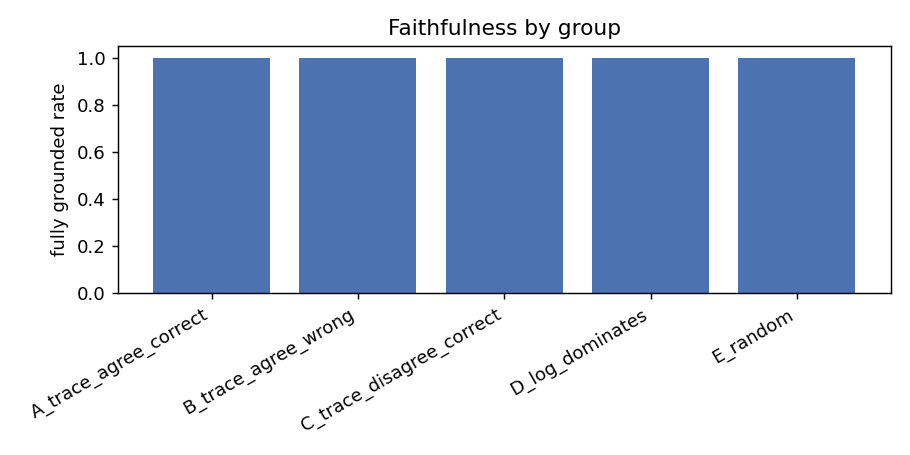
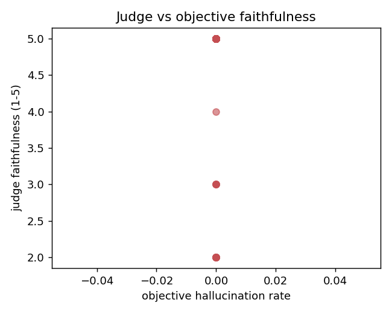

# Explanation evaluation — `cb_ce_awl`

## 1. Faithfulness (objective, hallucination check)
- samples: **200**
- atom-level hallucination rate (service/error names): **0.0000**
- fully grounded (atom-level): **1.000**
- explanation names the predicted root cause: **1.000**
- relational hallucination rate (wrong peer/direction/binding): **0.1017** (24/236 edges)
- modality misattribution rate: **0.0310** (8/258 attributions)
- **fully grounded (strict: atom+relational+modality): 0.855**

| group                    |   n |   halluc_rate |   grounded |
|:-------------------------|----:|--------------:|-----------:|
| A_trace_agree_correct    |  40 |        0.0000 |     1.0000 |
| B_trace_agree_wrong      |  40 |        0.0000 |     1.0000 |
| C_trace_disagree_correct |  40 |        0.0000 |     1.0000 |
| D_log_dominates          |  40 |        0.0000 |     1.0000 |
| E_random                 |  40 |        0.0000 |     1.0000 |



## 2. Utility (error detection + corrective recovery)
```
=== Explanation utility report ===
config: cb_ce_awl
verdicts (status=ok): 200
base error rate (model wrong): 0.3750

--- (a) error detection: flag model mistakes from verdict ---
  flag = contradict:
    confusion  TP=10 FP=29 FN=65 TN=96
    precision=0.256  recall=0.133  F1=0.175  specificity=0.768
    precision lift over always-trust baseline: 0.68x
  flag = contradict|unclear:
    confusion  TP=35 FP=47 FN=40 TN=78
    precision=0.427  recall=0.467  F1=0.446  specificity=0.624
    precision lift over always-trust baseline: 1.14x

  (baseline 'always trust' flags nothing: recall=0;
   baseline 'flag everything': precision = base error rate above.)

  contradict-flag precision/recall by true failure type:
    type 0: n=1 wrong=1 precision=0.000 recall=0.000
    type 1: n=5 wrong=3 precision=0.000 recall=0.000
    type 2: n=167 wrong=48 precision=0.222 recall=0.167
    type 3: n=25 wrong=22 precision=1.000 recall=0.091
    type 4: n=2 wrong=1 precision=0.000 recall=0.000

--- (b) corrective recovery (needs local sample text) ---
  samples with text: 200

  corrective recall = among model-WRONG cases in each subset,
  fraction whose explanation mentions the TRUE root cause.
  random baseline = mean(k/10), k = #distinct services named
  (chance of naming the true RC if k services were picked at random).

  subset                              n  corr.recall   random   lift
  wrong & contradict                 10        0.900    0.340   2.65x
  wrong & (contradict|unclear)       35        0.857    0.383   2.24x
  all wrong (ceiling, any verdict)   75        0.800    0.371   2.16x

  among 'wrong & contradict' (n=10):
    mentions predicted RC: 1.000
    mentions some other service (redirect present): 1.000
    mentions TRUE RC specifically: 0.900

  note: subsets are conditioned on the LLM verdict, so n shrinks
  fast (contradict is rare). 'all wrong' is verdict-independent.
  wrote logs/gaia/explanation_eval/cb_ce_awl/utility_per_sample.csv
```

## 3. LLM-as-judge (subjective, model-graded)
- samples judged: **200**
- judge_faithfulness: mean **4.79** (median 5)
- judge_completeness: mean **3.91** (median 4)
- judge_actionability: mean **3.02** (median 3)

```
=== LLM-as-judge report ===
config: cb_ce_awl   judge model: gpt-oss-120b
samples judged: 200  (ok: 200)

  judge_faithfulness     mean=4.79  median=5  min=2 max=5
  judge_completeness     mean=3.91  median=4  min=2 max=5
  judge_actionability    mean=3.02  median=3  min=1 max=5
  verdict_correct (yes): 0.810

--- validation vs objective faithfulness (atom+relational+modality) ---
  judge faithfulness, objectively clean:   mean=4.87 (n=171)
  judge faithfulness, objectively flagged: mean=4.38 (n=29)
  (a good judge scores the flagged group lower)
  Spearman(judge_faithfulness, #objective errors) = -0.205  (expected negative; n=200)

caveat: judge and explainer may share model-family biases; treat scores as indicative, not ground truth.
```



## Limitations
- Single config (`cb_ce_awl`), N≈200 explanations, one dataset (GAIA).
- Faithfulness is *evidence-bounded*: it checks consistency with the given evidence, not absolute correctness of the diagnosis.
- Judge and explainer may share model-family biases; judge scores are indicative, not ground truth.
- `contradict` is a signal, not a calibrated confidence — see the error-detection precision/recall above.
